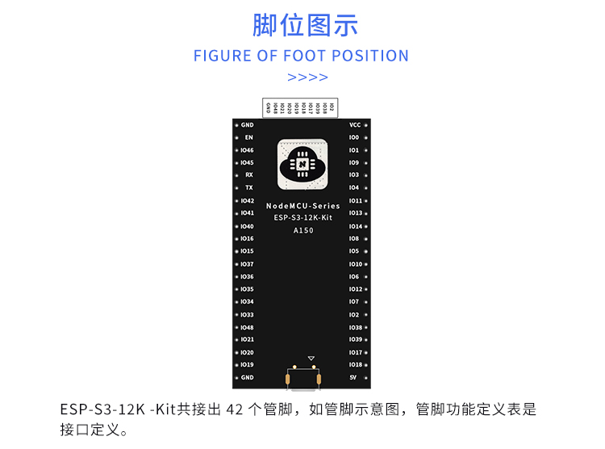

稚晖君小机器人项目

本人使用的是esp32-s3进行复刻

SDK为esp-idf-v4.4

使用的是source insight进行代码编辑，然后使用esp32-s3提供的命令行进行编译下载

为了开发方便，我是在esp-idf-v4.4目录下新建app文件夹，然后clone此代码到app目录，

新建source insight工程，包括esp-idf-v4.4下的所有文件

# 说明：代码还在移植开发中，并不能使用。

所使用的开发板

###### 1.28寸显示屏使用的管脚：

|        功能        |    io口     |
| :----------------: | :---------: |
|     GPIO_MOSI      | GPIO_NUM_11 |
|     GPIO_MISO      | GPIO_NUM_13 |
|     GPIO_SCLK      | GPIO_NUM_12 |
|      GPIO_CS       | GPIO_NUM_10 |
| GPIO_OUTPUT_IO_BLK | GPIO_NUM_0  |
| GPIO_OUTPUT_IO_DC  | GPIO_NUM_1  |
| GPIO_OUTPUT_IO_RES | GPIO_NUM_9  |

###### 手势传感器使用的管脚：

| 功能 | io口 |
| :--: | :--: |
|      |      |
|      |      |
|      |      |

###### 摄像头使用的管脚：

| 功能 | io口 |
| :--: | :--: |
|      |      |
|      |      |
|      |      |
|      |      |
|      |      |
|      |      |
|      |      |
|      |      |
|      |      |

